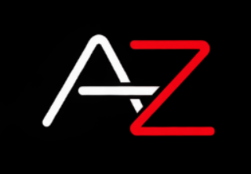
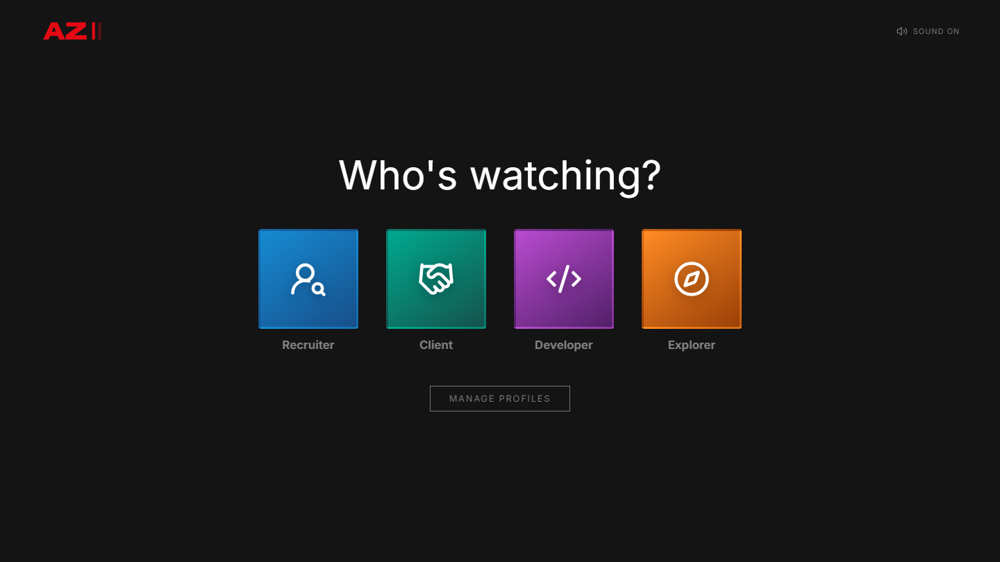
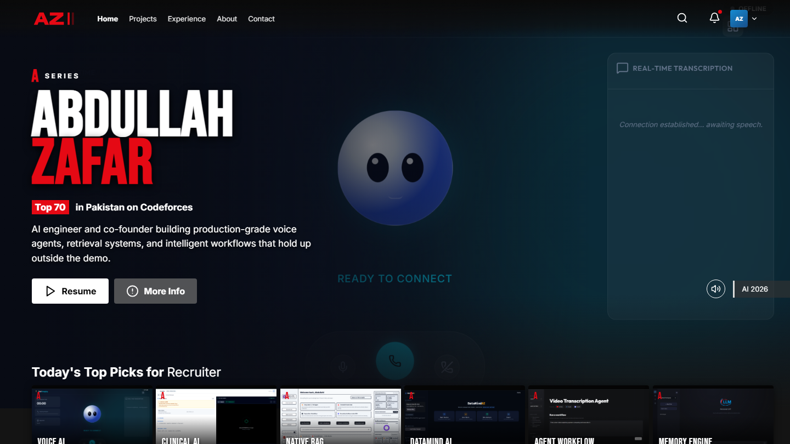

<div align="center">
  

  # Abdullah Zafar - Netflix-Inspired Portfolio

  **A high-performance cinematic portfolio for an AI engineer building production-grade systems.**

  [](https://abdullahzafar.tech)
  [](./assets/documents/Abdullah-Zafar-Resume.pdf)
  [](https://www.linkedin.com/in/abdullahz-dev/)
  [](https://github.com/Abdullah-Zafarr)
  [-1F8ACB?style=for-the-badge&logo=codeforces&logoColor=white)](https://codeforces.com/profile/rodrickkkk)
</div>

---

## 🍿 The Experience

This is not a conventional developer portfolio. It translates the design language and interaction patterns of Netflix into a dynamic, streaming-style portfolio engineered for recruiters, clients, and technical teams.

Visitors choose a viewing profile, hear the signature cinematic intro sound, browse ranked engineering rails, inspect structured project cards with real architectural metrics, read in-depth engineering logs, and switch views seamlessly.

<p align="center">
  
  
</p>

## ✨ What Makes It Different

- **Netflix Profile Selection & Memes**: Interactive "Who's Watching?" gate with sound effects, dynamic meme avatar reflections, and profile switcher.
- **Structured Netflix Project Cards**: High-definition obsidian card containers with crisp outlines, live teaser overlays, visible architectural summaries, tech stack chips, and instant modal / code actions.
- **Blog & Technical Engineering Logs**: Deep-dive technical articles covering Voice AI latency, Native RAG, LangGraph Clinical Agents, and Algorithmic engineering with category filters and interactive modal reading.
- **Clean, Extensionless URLs**: Built with directory-based routing and universal hosting support (`/projects`, `/experience`, `/about`, `/blog`, `/contact`) without `.html` extensions.
- **Authentic Engineering Work**: Every featured title is backed by real production code, benchmark metrics, live demos, and verifiable GitHub repositories.
- **Instant Search & TV Remote / Keyboard Navigation**: Full keyboard directional navigation (`Arrow Keys`, `Enter`, `Escape`) and real-time project filtering.
- **Universal Static Architecture**: Pure vanilla HTML5, CSS3, and JavaScript — zero heavy framework dependencies or build overhead.

## 🚀 Featured AI Projects

| Project | What it does | Metrics / Benchmark | Core Stack | Links |
| --- | --- | --- | --- | --- |
| **Production-Grade Voice Agent** | Full-duplex conversational voice system with Twilio telephony, WebSocket streaming audio, and Deepgram STT. | **Sub-750ms Latency** | TypeScript, Twilio, Deepgram, Groq | [Code](https://github.com/Abdullah-Zafarr/Production_Grade_Voice_Agent) |
| **Autonomous Clinical Reporter** | Event-driven healthcare platform converting ultrasound medical scans into validated diagnostic reports. | **99.4% Validated** | TypeScript, LangGraph, Pydantic, Gemini | [Code](https://github.com/Abdullah-Zafarr/Autonomous-Clinical-Reporter) · [Live Demo](https://ultrasound-reporting-service.vercel.app) |
| **Native RAG Architecture** | Framework-free production RAG engine with OCR ingestion, vector-store purging, and grounding telemetry. | **Framework-free** | Python, ChromaDB, OCR, Groq | [Code](https://github.com/Abdullah-Zafarr/Native-RAG-Architecture) |
| **LLM Data Analyst** | Conversational analyst executing sandboxed Pandas code with self-correcting debug loops. | **91% Self-Fix Rate** | Python, Pandas, Streamlit, Groq | [Code](https://github.com/Abdullah-Zafarr/LLM-Data-Analyst-Groq) |
| **Multimodal Agentic Workflow** | Multi-agent reasoning pipeline combining web search, audio extraction, and Gemini Multimodal. | **Multi-Tool Pipeline** | Python, Gemini, SerpAPI, Streamlit | [Code](https://github.com/Abdullah-Zafarr/Multimodal-Agentic-Workflow) |
| **Mem0 Graph Memory Engine** | Persistent memory engine with multi-session user facts, contradiction handling, and Qdrant storage. | **Long-term Graph** | Python, Mem0, Qdrant, Agents | [Code](https://github.com/Abdullah-Zafarr/Mem0-Graph-Memory-Engine) |

## 📝 Engineering Logs & Technical Deep Dives

The portfolio features full-length technical breakdowns on modern AI engineering:
1. **Sub-750ms Voice AI**: Full-duplex voice pipelines, Twilio WebSockets, Deepgram Nova-2, and Groq streaming.
2. **Native RAG from Scratch**: Ingesting messy PDF/OCR documents, semantic chunking, and grounding telemetry.
3. **Clinical AI with LangGraph**: Multi-agent state machines, structured validation, and HIPAA considerations.
4. **Competitive Programming & Systems**: How 100+ daily streaks and Top 70 Codeforces rank inform production AI architecture.
5. **Persistent Graph Memory**: Overriding contradictory facts across multi-turn sessions with Mem0 & Qdrant.

## 🛠️ Technology Stack

<p>
  
  
  
  
  
</p>

## 📂 Repository Structure

```text
.
├── index.html                         # Who's Watching? entry gate
├── projects/
│   └── index.html                     # Clean URL: /projects
├── experience/
│   └── index.html                     # Clean URL: /experience
├── about/
│   └── index.html                     # Clean URL: /about
├── blog/
│   └── index.html                     # Clean URL: /blog
├── contact/
│   └── index.html                     # Clean URL: /contact
├── assets/
│   ├── audio/                         # Ta-dum intro audio
│   ├── css/                           # Global styles & Netflix design system
│   ├── documents/                     # PDF Resume
│   ├── icons/                         # Brand AZ emblem & tech icons
│   ├── images/
│   │   ├── profile/                   # Portrait & meme avatars
│   │   └── projects/                  # Production UI screenshots
│   ├── js/                            # Routing, state, articles, & interactions
│   └── vendor/                        # Vendored dependencies (Lucide icons)
├── vercel.json                        # Clean URL routing configuration
├── .nojekyll                          # GitHub Pages static asset bypass
└── README.md
```

## 💻 Run Locally

Clone the repository and start a local HTTP server:

```bash
git clone https://github.com/Abdullah-Zafarr/abdullah-zafar-portfolio.git
cd abdullah-zafar-portfolio
python -m http.server 8000
```

Open [http://localhost:8000](http://localhost:8000) in your browser.

## 📬 Contact & Connect

- **Website:** [abdullahzafar.tech](https://abdullahzafar.tech)
- **Email:** [abdullahzafar.codes@gmail.com](mailto:abdullahzafar.codes@gmail.com)
- **LinkedIn:** [linkedin.com/in/abdullahz-dev](https://www.linkedin.com/in/abdullahz-dev/)
- **GitHub:** [github.com/Abdullah-Zafarr](https://github.com/Abdullah-Zafarr)
- **Codeforces:** [codeforces.com/profile/rodrickkkk](https://codeforces.com/profile/rodrickkkk)

---

<div align="center">
  <strong>Designed & Engineered by Abdullah Zafar</strong>
</div>
