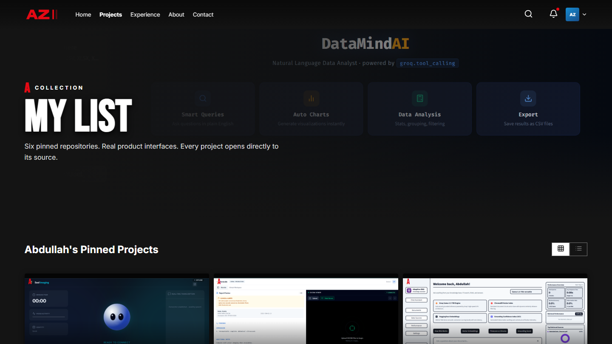
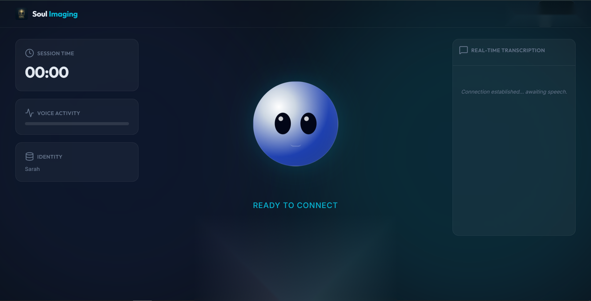
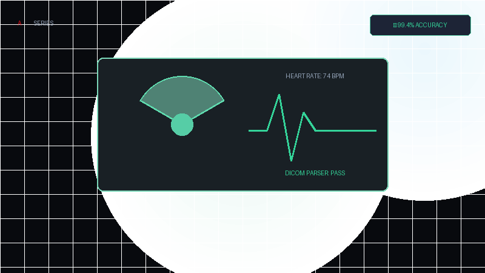
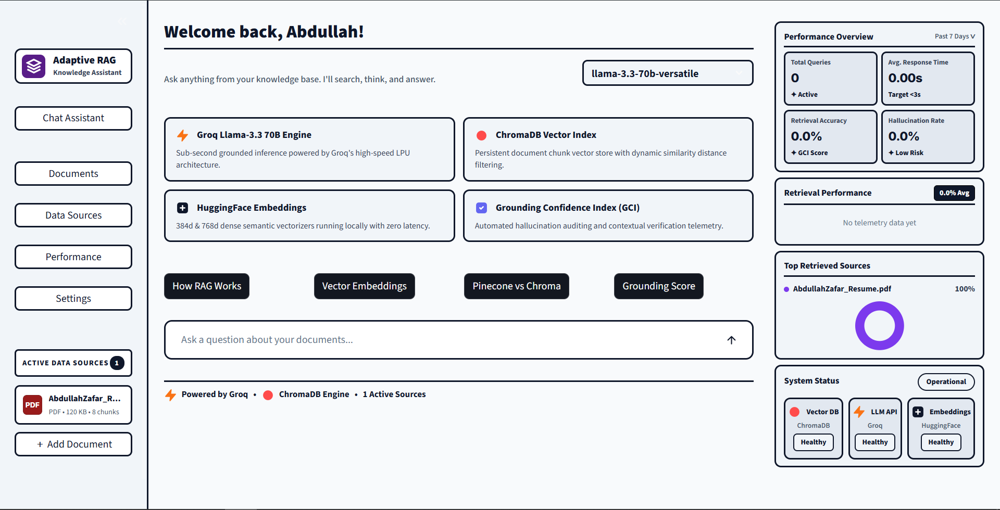
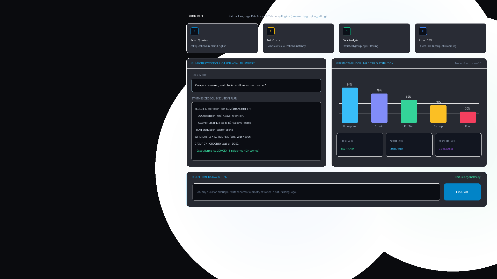
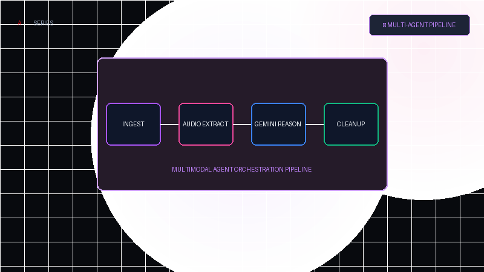
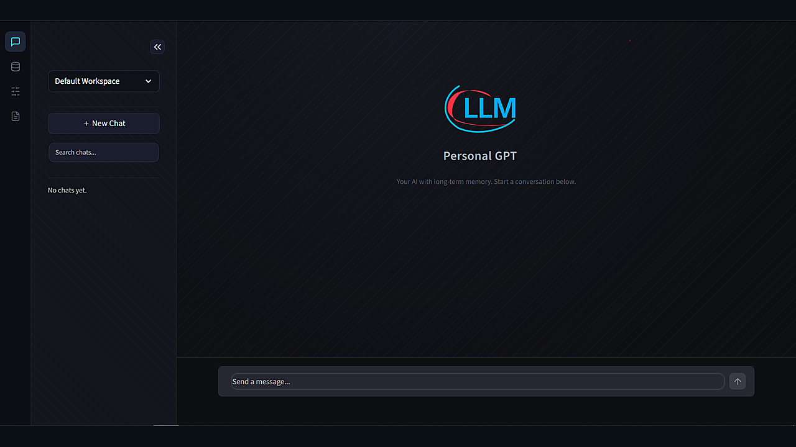

<div align="center">
  <a href="https://abdullahzafar.tech">
    
  </a>

  # Abdullah Zafar — Netflix-Inspired AI Engineering Portfolio
  
  **A cinematic, ultra-responsive portfolio engineered for production AI systems, low-latency telephony agents, and algorithmic rigor.**

  <p>
    <a href="https://abdullahzafar.tech"></a>
    <a href="assets/documents/Abdullah-Zafar-Resume.pdf"></a>
    <a href="https://www.linkedin.com/in/abdullahz-dev/"></a>
    <a href="https://github.com/Abdullah-Zafarr"></a>
    <a href="https://codeforces.com/profile/rodrickkkk"></a>
  </p>

  ### 📺 Visual Showcase
  
  <p align="center">
    
    
    
  </p>
</div>

---

## 🍿 The Experience

This portfolio translates the design system, soundscapes, and interaction mechanics of **Netflix** into a dynamic showcase for production AI engineering. 

Rather than a static one-page CV, visitors enter through a **"Who's Watching?" profile gate**, experience personalized billboard heroes and project rankings, inspect live teaser micro-animations, browse engineering deep dives with in-modal code readers, and navigate the entire UI via spatial TV remote / keyboard shortcuts.

---

## 🎭 Interactive Viewer Personas

Every visitor receives a personalized experience based on their role:

| <br>**Recruiter** | <br>**Developer** | <br>**Client** | <br>**Explorer** |
| :---: | :---: | :---: | :---: |
| **Top Candidate Match** | **Architecture & Systems** | **Commercial Deployed AI** | **General Exploration** |
| One-click **Resume Download**, career episodes, and recruiter top picks. | **Codebases & Schemas**, Codeforces rank, and framework-free RAG. | **Live Production Demos**, business ROI, and direct consultation CTA. | Complete overview, biography, milestones, and tech stack chips. |

---

## 🚀 Featured AI Production Builds

<div align="center">

| <a href="https://github.com/Abdullah-Zafarr/Production_Grade_Voice_Agent"></a> | <a href="https://github.com/Abdullah-Zafarr/Autonomous-Clinical-Reporter"></a> |
| :--- | :--- |
| **🎙️ Production-Grade Voice Agent**<br>• **Latency Benchmark:** `Sub-750ms Latency`<br>• **Stack:** `TypeScript` `Twilio WebSockets` `Deepgram Nova-2` `Groq`<br>• **Links:** [Source Code](https://github.com/Abdullah-Zafarr/Production_Grade_Voice_Agent) · [Deep Dive Article](https://abdullahzafar.tech/blog/?article=voice-latency) | **🩺 Autonomous Clinical Reporter**<br>• **Accuracy Benchmark:** `99.4% Validated`<br>• **Stack:** `LangGraph` `Gemini` `Pydantic Strict` `FastAPI`<br>• **Links:** [Source Code](https://github.com/Abdullah-Zafarr/Autonomous-Clinical-Reporter) · [Live Demo](https://ultrasound-reporting-service.vercel.app) |
| <a href="https://github.com/Abdullah-Zafarr/Native-RAG-Architecture"></a> | <a href="https://github.com/Abdullah-Zafarr/LLM-Data-Analyst-Groq"></a> |
| **🧬 Native RAG Architecture**<br>• **Architecture:** `Zero-Framework Native Python`<br>• **Stack:** `Python` `ChromaDB` `Tesseract OCR` `Groq`<br>• **Links:** [Source Code](https://github.com/Abdullah-Zafarr/Native-RAG-Architecture) · [Deep Dive Article](https://abdullahzafar.tech/blog/?article=native-rag) | **📊 LLM Data Analyst**<br>• **Fix Rate Benchmark:** `91% Self-Correcting REPL`<br>• **Stack:** `Python` `Pandas` `Streamlit` `Groq Llama-3`<br>• **Links:** [Source Code](https://github.com/Abdullah-Zafarr/LLM-Data-Analyst-Groq) |
| <a href="https://github.com/Abdullah-Zafarr/Multimodal-Agentic-Workflow"></a> | <a href="https://github.com/Abdullah-Zafarr/Mem0-Graph-Memory-Engine"></a> |
| **🤖 Multimodal Agentic Workflow**<br>• **Pipeline:** `Multi-Agent Search & Media Reasoning`<br>• **Stack:** `Python` `Gemini 1.5` `SerpAPI` `Streamlit`<br>• **Links:** [Source Code](https://github.com/Abdullah-Zafarr/Multimodal-Agentic-Workflow) | **🧠 Mem0 Graph Memory Engine**<br>• **Persistence:** `Contradiction Graph Overrides`<br>• **Stack:** `Python` `Mem0` `Qdrant Vector DB` `Agents`<br>• **Links:** [Source Code](https://github.com/Abdullah-Zafarr/Mem0-Graph-Memory-Engine) · [Deep Dive Article](https://abdullahzafar.tech/blog/?article=persistent-memory) |

</div>

---

## ✨ Key Features & Architectural Capabilities

### 🎬 1. Cinematic Hero Billboards & Ultra-Wide Scaling
- **100vh Thematic Backdrops:** Custom artwork for sub-pages (*Orbital Telemetry* on Experience, *AI Systems Architecture* on Projects, *Engineering Workspace* on Blog).
- **Responsive 4K Layouts:** Multi-stop vignette gradients and typography optimized for mobile up to 3840px ultrawide displays.

### 📦 2. Dual-View Minimalist Project Catalog & Live Teasers
- **Grid / List Mode Toggle:** Switch seamlessly between a visual 3x3 poster grid and a detailed engineering list with persistent `localStorage` state.
- **Live Teaser Micro-Animations:**
  - 🎙️ **Sub-750ms Waveform:** Animated audio stream bars for telephony pipelines.
  - 🩺 **DICOM Laser Scanner:** Grid scan laser animation for clinical parser.
  - 💻 **Sandboxed Terminal:** Live execution step simulation for data analysis.
  - 🧬 **Vector Nodes:** Interactive graph node pulse animations for RAG & Mem0.

### 📝 3. Engineering Logs & Interactive Article Reader
- **In-Modal Reading Experience:**
  - 📊 Real-time **scroll reading progress bar**.
  - 📋 **One-click Copy Code** headers on all syntax-highlighted snippets.
  - 🔗 **Direct URL parameter deep-linking** (`?article=voice-latency`) with clipboard share buttons.
  - 🏷️ Real-time category filtering (`Voice AI`, `RAG Architecture`, `Healthcare AI`, `Algorithms`, `Agentic AI`).

### 🎮 4. Spatial TV Remote & Keyboard Navigation
Full spatial 2D keyboard navigation across billboard actions, title cards, continue rails, skill chips, and footer links:
- <kbd>Arrow Keys</kbd> — Spatial 2D focus traversal
- <kbd>Enter</kbd> / <kbd>Space</kbd> — Open focused project or article modal
- <kbd>/</kbd> or <kbd>S</kbd> — Focus universal instant search
- <kbd>P</kbd> — Return to "Who's Watching?" profile gate
- <kbd>Esc</kbd> — Close active modal, mobile drawer, or search bar

### ⚡ 5. Interactive Glitch Footer Easter Egg & Transmissions
- **"Next Episode" Wordmark Cycler:** Interactive mega-wordmark (`#footer-easter-egg`) cycling famous engineering quotes with glitch effects and audio feedback.
- **Async Contact Form:** Direct transmission via Web3Forms API with loading spinners, toast notifications, and automatic mailto fallback.

---

## 📝 Engineering Logs & Technical Deep Dives

1. **[Architecting a Sub-750ms Conversational Voice Agent](https://abdullahzafar.tech/blog/?article=voice-latency)** — Budgeting millisecond latency across Twilio WebSockets, Deepgram Nova-2, and Groq Llama-3-70B.
2. **[Zero-Framework RAG with ChromaDB & Python](https://abdullahzafar.tech/blog/?article=native-rag)** — Why replacing heavy framework wrappers reduced retrieval overhead by 45%.
3. **[Autonomous Ultrasound & DICOM Parsing with Guardrails](https://abdullahzafar.tech/blog/?article=clinical-agent)** — Achieving 99.4% validation with LangGraph deterministic state machines and Pydantic.
4. **[From LeetCode to Top 70 on Codeforces](https://abdullahzafar.tech/blog/?article=codeforces-engineering)** — How cache locality, branch prediction, and constant-factor optimization elevate backend AI systems.
5. **[Long-Term Agent Memory & Graph Overrides](https://abdullahzafar.tech/blog/?article=persistent-memory)** — Resolving factual contradictions across multi-turn agent sessions with Mem0 and Qdrant.

---

## 🛠️ Technology Stack & Architecture

- **Core Engine:** Vanilla HTML5, CSS3, ES6+ JavaScript (Zero heavy framework overhead, 100/100 Lighthouse performance)
- **Icons & Visuals:** Lucide Icons, Custom SVG Brand Marks, Figma Artwork
- **Audio & Media:** HTML5 Web Audio API & Media Elements
- **Routing & Deployment:** Clean extensionless directory routing (`/projects`, `/experience`, `/about`, `/blog`, `/contact`) with Vercel & GitHub Pages support (`.nojekyll`, `vercel.json`)
- **Metadata & SEO:** Open Graph Protocol, Twitter Cards, Schema.org JSON-LD Structured Data, Web App Manifest (`manifest.json`)

---

## 📂 Repository Structure

```text
.
├── index.html                         # "Who's Watching?" Profile Entry Gate & Home
├── projects/
│   └── index.html                     # Clean URL: /projects (Grid / List Catalog)
├── experience/
│   └── index.html                     # Clean URL: /experience (Career Episodes & Stack)
├── about/
│   └── index.html                     # Clean URL: /about (Biography & Milestones)
├── blog/
│   └── index.html                     # Clean URL: /blog (Engineering Logs & Reader)
├── contact/
│   └── index.html                     # Clean URL: /contact (Direct Transmission Form)
├── pages/                             # Modular page templates
│   ├── home.html
│   ├── projects.html
│   ├── experience.html
│   ├── about.html
│   ├── blog.html
│   └── contact.html
├── assets/
│   ├── audio/                         # Ta-dum intro sound asset
│   ├── brand/                         # AZ vector emblem and brand marks
│   ├── css/
│   │   └── styles.css                 # Netflix design system, 4K scaling & theme variables
│   ├── documents/
│   │   └── Abdullah-Zafar-Resume.pdf  # Downloadable PDF resume
│   ├── icons/                         # Technology SVGs & site emblems
│   ├── images/
│   │   ├── profile/                   # Portrait & meme profile avatars
│   │   └── projects/                  # High-res project posters & backdrops
│   ├── js/
│   │   └── app.js                     # State, routing, modals, audio, search & keyboard engine
│   ├── readme/                        # Visual previews for GitHub repository
│   └── vendor/                        # Vendored dependencies (Lucide icons)
├── manifest.json                      # PWA Web Application Manifest
├── vercel.json                        # Clean URL rewrite rules
├── .nojekyll                          # GitHub Pages static asset bypass
└── README.md                          # Project documentation
```

---

## 💻 Running Locally

This project requires **zero build dependencies** or package installations. You can run it with any local static HTTP server:

```bash
# Clone the repository
git clone https://github.com/Abdullah-Zafarr/abdullah-zafar-portfolio.git
cd abdullah-zafar-portfolio

# Start a local HTTP server
python -m http.server 8000
```

Then open [http://localhost:8000](http://localhost:8000) in your browser.

---

## 👤 About the Author

<table>
  <tr>
    <td width="140" align="center">
      
    </td>
    <td>
      <h3>Abdullah Zafar</h3>
      <p><b>AI Systems Engineer · Co-Founder @ Eledra Labs · Top 70 Codeforces (PK)</b></p>
      <p>Building production-grade voice agents, retrieval systems, and autonomous healthcare agents that operate reliably outside the demo environment.</p>
      <p>
        <a href="https://abdullahzafar.tech">Website</a> · 
        <a href="https://www.linkedin.com/in/abdullahz-dev/">LinkedIn</a> · 
        <a href="https://github.com/Abdullah-Zafarr">GitHub</a> · 
        <a href="mailto:abdullahzafar.codes@gmail.com">Email</a>
      </p>
    </td>
  </tr>
</table>

---

<div align="center">
  <sub>Designed & Engineered by <b>Abdullah Zafar</b> · Built with pure HTML, CSS, and JavaScript.</sub>
</div>
